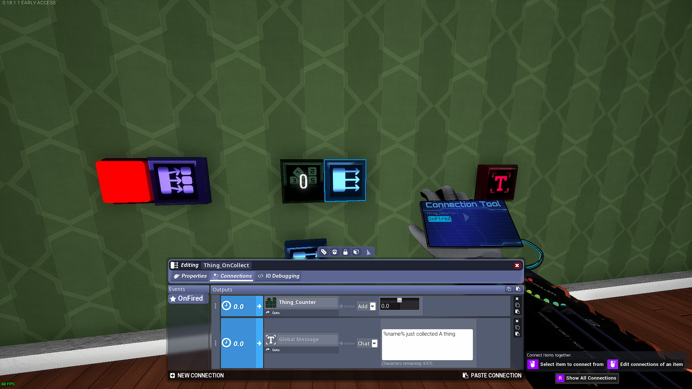
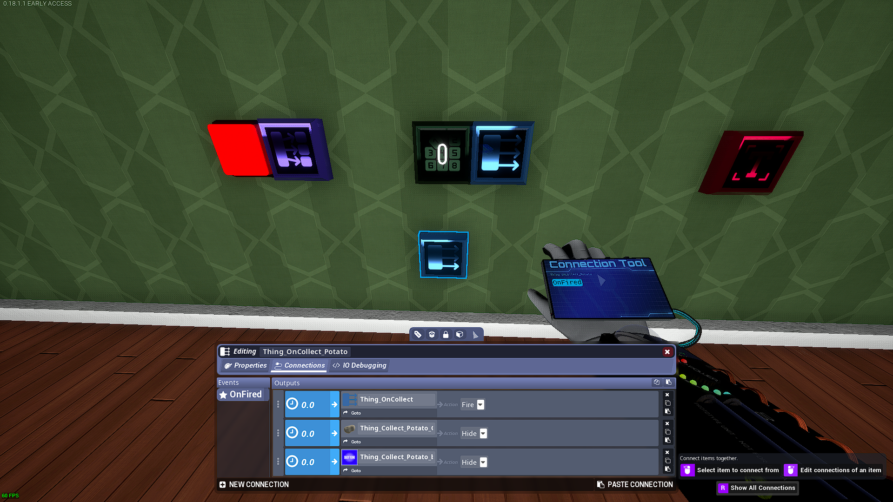
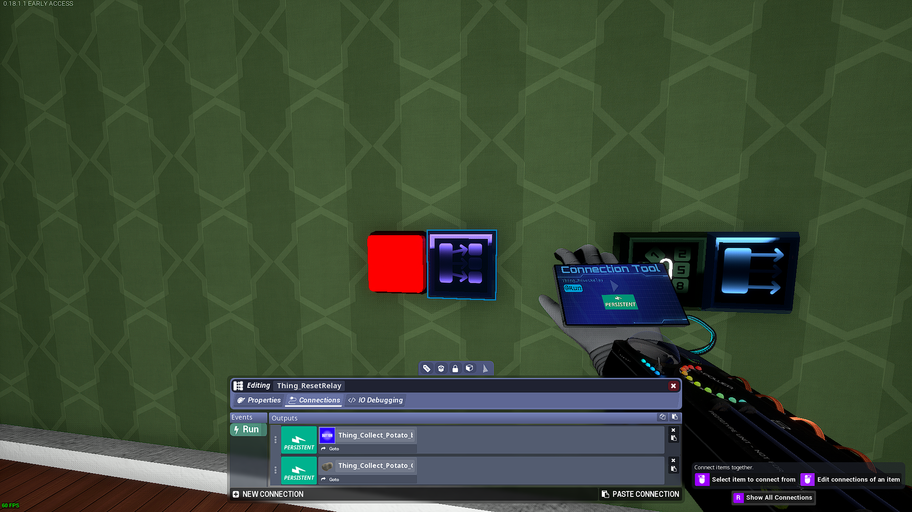

# Collectathon System
Hello, and welcome to the first guide in what will hopefully become a series.\
In this installation, we'll build a system that might prove useful for adventure maps in Tower Unite
## The Tracker
The Tracker keeps track of the number of collectibles found and is responsible for sending the collection message

Trackers consist of 2 or 3 components:
1. a Counter Module for keeping track of collected items
2. a Relay Module for the universal OnCollect
3. a Global Message Module for possible collection message (optional)

Configure the relay's ```OnFired``` event like this (leave the global message part out if you don't want a message)

In this guide, we'll leave the counter's events empty, but you can attach the ```@logic``` of it to one or more Logic Compare Modules to do things after a certain treshold has been passed
## The Collectible(s)
Collectibles are a core part of the system.  You wouldn't be looking for anything if there was nothing to look for, right?

The Collectible consists of 3 components
1. a button
2. a relay for organization
3. an optional item representing the collectible if the interactable part is meshless (in this case we use the coveted potato)\


Configure the button's ```OnPressed``` event like this:

Configure the relay's ```OnFired``` event like this:

## The Resetter
The resetter restores the state of collectibles to it's default state (Hence its name)

The resetter consists of 2 components:
1. a Relay To All Module
2. a Button

Configure the ```@Run``` of the Relay To All collectibles and their visual representations like this:

Configure the button's ```OnPressed``` event like this:
